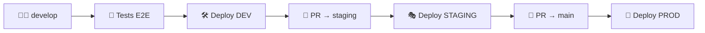

# 🌍 Configuration des Environnements

Ce projet utilise **GitHub Environments** pour gérer différentes configurations selon les branches.

## 📋 Mapping Branches → Environments

| Branche | Environnement GitHub | Netlify Alias | Description |
|---------|---------------------|---------------|-------------|
| `main` | `production` | `main` (prod) | 🚀 Production live |
| `staging` | `staging` | `staging` | 🎭 Tests finaux pré-prod |
| `develop` | `development` | `dev` | 🛠️ Développement |
| Autres | `development` | `preview` | 👀 Preview temporaire |

## 🔧 Configuration GitHub Environments

### 1. Créer les Environments

Dans votre repo GitHub :
1. **Settings** → **Environments**
2. Créer 3 environments :

#### **🚀 Production Environment**
- **Nom**: `production`
- **Protection Rules**:
  - ✅ Required reviewers (optionnel)
  - ✅ Wait timer: 0 minutes
  - ✅ Restrict to `main` branch

#### **🎭 Staging Environment** 
- **Nom**: `staging`
- **Protection Rules**:
  - ✅ Restrict to `staging` branch

#### **🛠️ Development Environment**
- **Nom**: `development`
- **Protection Rules**:
  - ✅ Restrict to `develop` branch

### 2. Variables d'Environnement par Environment

Chaque environment a ses propres secrets :

#### **Production Secrets** (environment: `production`)
```bash
# Netlify
NETLIFY_AUTH_TOKEN=your_prod_netlify_token
NETLIFY_SITE_ID=your_prod_site_id

# App Variables (PROD)
REACT_APP_FORM_PASSWORD=your_secure_prod_password
REACT_APP_WEBHOOK_URL=https://hook.us1.make.com/PROD_WEBHOOK_ID
REACT_APP_WEBHOOK_URL_FILES=https://hook.us1.make.com/PROD_FILES_WEBHOOK_ID
REACT_APP_HUBSPOT_COMPANY_ID=your_prod_hubspot_company_id
REACT_APP_HUBSPOT_DEAL_ID=your_prod_hubspot_deal_id
REACT_APP_HUBSPOT_CONTACT_ID=your_prod_hubspot_contact_id
REACT_APP_HUBSPOT_DRIVE_ID=your_prod_drive_id
```

#### **Staging Secrets** (environment: `staging`)
```bash
# Netlify
NETLIFY_AUTH_TOKEN=your_staging_netlify_token
NETLIFY_SITE_ID=your_staging_site_id

# App Variables (STAGING)
REACT_APP_FORM_PASSWORD=staging_password_123
REACT_APP_WEBHOOK_URL=https://hook.us1.make.com/STAGING_WEBHOOK_ID
REACT_APP_WEBHOOK_URL_FILES=https://hook.us1.make.com/STAGING_FILES_WEBHOOK_ID
REACT_APP_HUBSPOT_COMPANY_ID=your_staging_hubspot_company_id
REACT_APP_HUBSPOT_DEAL_ID=your_staging_hubspot_deal_id
REACT_APP_HUBSPOT_CONTACT_ID=your_staging_hubspot_contact_id
REACT_APP_HUBSPOT_DRIVE_ID=your_staging_drive_id
```

#### **Development Secrets** (environment: `development`)
```bash
# Netlify
NETLIFY_AUTH_TOKEN=your_dev_netlify_token
NETLIFY_SITE_ID=your_dev_site_id

# App Variables (DEV)
REACT_APP_FORM_PASSWORD=dev123
REACT_APP_WEBHOOK_URL=https://webhook.site/dev-test-id
REACT_APP_WEBHOOK_URL_FILES=https://webhook.site/dev-files-test-id
REACT_APP_HUBSPOT_COMPANY_ID=12345
REACT_APP_HUBSPOT_DEAL_ID=67890
REACT_APP_HUBSPOT_CONTACT_ID=11111
REACT_APP_HUBSPOT_DRIVE_ID=test-drive-id
```

## 🔄 Workflow de Déploiement

### Développement → Staging → Production



### URLs Netlify Générées

```bash
# Production (main)
https://your-site.netlify.app

# Staging 
https://staging--your-site.netlify.app

# Development
https://dev--your-site.netlify.app

# Preview branches
https://preview-COMMIT--your-site.netlify.app
```

## 🚀 Utilisation

### Push sur develop
```bash
git checkout develop
git add .
git commit -m "🛠️ New feature"
git push origin develop
```
→ **Deploy automatique** sur `dev--your-site.netlify.app`

### Promotion vers staging
```bash
git checkout staging
git merge develop
git push origin staging
```
→ **Deploy automatique** sur `staging--your-site.netlify.app`

### Release en production
```bash
git checkout main
git merge staging
git push origin main
```
→ **Deploy automatique** sur `your-site.netlify.app` (PROD)

## 🔍 Variables Injectées Automatiquement

En plus de vos secrets, le workflow injecte automatiquement :

```javascript
// Dans votre app React
process.env.REACT_APP_ENVIRONMENT  // "production" | "staging" | "development"
process.env.REACT_APP_BRANCH        // "main" | "staging" | "develop"
```

### Utilisation dans le code

```typescript
// src/config/environment.ts
export const config = {
  environment: process.env.REACT_APP_ENVIRONMENT || 'development',
  branch: process.env.REACT_APP_BRANCH || 'local',
  isProduction: process.env.REACT_APP_ENVIRONMENT === 'production',
  isDevelopment: process.env.REACT_APP_ENVIRONMENT === 'development',
  
  // Variables spécifiques selon l'env
  api: {
    webhookUrl: process.env.REACT_APP_WEBHOOK_URL!,
    filesUrl: process.env.REACT_APP_WEBHOOK_URL_FILES!,
  },
  
  // Debug info (retiré en prod)
  showDebugInfo: process.env.REACT_APP_ENVIRONMENT !== 'production'
};
```

```typescript
// Dans vos composants
import { config } from './config/environment';

const MyComponent = () => {
  return (
    <div>
      {config.showDebugInfo && (
        <div className="debug-info">
          Environment: {config.environment} | Branch: {config.branch}
        </div>
      )}
    </div>
  );
};
```

## 📊 Monitoring

### GitHub Actions
- ✅ **Tests E2E** lancés sur toutes les branches
- ✅ **Deploy automatique** selon la branche
- ✅ **Protection** : pas de deploy si tests échouent

### Netlify
- ✅ **Preview URLs** pour chaque environnement
- ✅ **Deploy notifications** dans GitHub
- ✅ **Rollback facile** via interface Netlify

## 🛠️ Troubleshooting

### Vérifier les variables d'environnement
```bash
# Dans les logs GitHub Actions
echo "Environment: ${{ needs.determine-environment.outputs.environment }}"
echo "Netlify Alias: ${{ needs.determine-environment.outputs.netlify-alias }}"
```

### Tester localement
```bash
# Simuler l'environnement de staging
REACT_APP_ENVIRONMENT=staging npm start

# Simuler la production
REACT_APP_ENVIRONMENT=production npm run build
```
